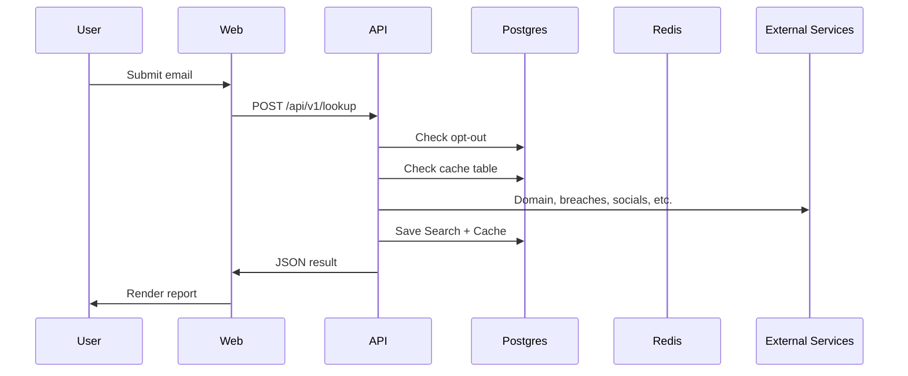
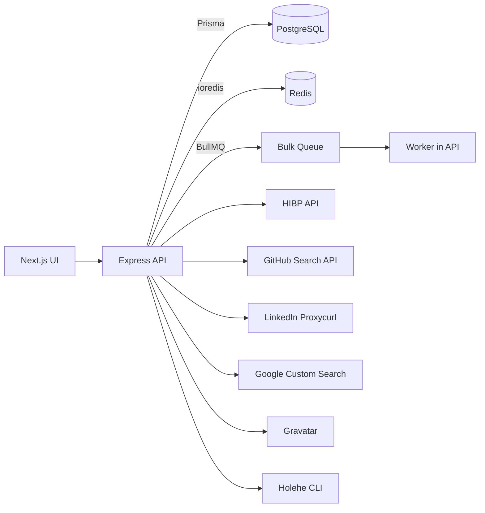

# BehindTheEmail Complete Interactive Developer Guide

## Cover Page

**Project Name:** BehindTheEmail  
**Repository Purpose:** Full-stack OSINT SaaS platform for email-to-identity intelligence.  
**Version:** 1.0.0  
**Author:** Generated by GitHub Copilot Task Agent  
**Generated Date:** 2026-05-29  
**Intended Audience:** Complete beginners, developers, DevOps engineers, security researchers, and long‑term maintainers.  
**Learning Outcomes:**
- Understand the complete system architecture and request lifecycle.
- Install, configure, and run the platform locally.
- Understand the data flow across API, database, Redis, and queues.
- Debug, extend, and deploy the application safely.
- Maintain and scale the system with confidence.

---

## Table of Contents

- [Reader Profile Selection](#reader-profile-selection)
- [Learning Path Dashboard](#learning-path-dashboard)
- [Chapter 1: Executive Overview](#chapter-1-executive-overview)
- [Chapter 2: Project Architecture](#chapter-2-project-architecture)
- [Chapter 3: Repository Walkthrough](#chapter-3-repository-walkthrough)
- [Chapter 4: Environment Setup Guide](#chapter-4-environment-setup-guide)
- [Chapter 5: Installation Walkthrough](#chapter-5-installation-walkthrough)
- [Chapter 6: Environment Variables Guide](#chapter-6-environment-variables-guide)
- [Chapter 7: Database Deep Dive](#chapter-7-database-deep-dive)
- [Chapter 8: Redis Deep Dive](#chapter-8-redis-deep-dive)
- [Chapter 9: Prisma Deep Dive](#chapter-9-prisma-deep-dive)
- [Chapter 10: Backend Deep Dive](#chapter-10-backend-deep-dive)
- [Chapter 11: API Reference](#chapter-11-api-reference)
- [Chapter 12: Frontend Deep Dive](#chapter-12-frontend-deep-dive)
- [Chapter 13: Queue System](#chapter-13-queue-system)
- [Chapter 14: Security Analysis](#chapter-14-security-analysis)
- [Chapter 15: Debugging Handbook](#chapter-15-debugging-handbook)
- [Chapter 16: Production Deployment](#chapter-16-production-deployment)
- [Chapter 17: Scaling Guide](#chapter-17-scaling-guide)
- [Chapter 18: Maintenance Guide](#chapter-18-maintenance-guide)
- [Chapter 19: Contributor Guide](#chapter-19-contributor-guide)
- [Chapter 20: Source Code Walkthrough](#chapter-20-source-code-walkthrough)
- [Quick Reference Section](#quick-reference-section)

---

## Reader Profile Selection

**Who are you?**

- **Option A: Complete Beginner**
  - Prioritize Chapters 1–9, 15–16, and Quick Reference.
- **Option B: Frontend Developer**
  - Prioritize Chapters 1–3, 6, 11–12, 15, and Quick Reference.
- **Option C: Backend Developer**
  - Prioritize Chapters 1–3, 6–11, 13–15, and Quick Reference.
- **Option D: DevOps Engineer**
  - Prioritize Chapters 1–3, 4–5, 7–8, 16–18, and Quick Reference.
- **Option E: Security Researcher**
  - Prioritize Chapters 1–3, 10–14, and Quick Reference.
- **Option F: Project Maintainer**
  - Read everything, with extra focus on Chapters 18–20.

---

## Learning Path Dashboard

Use this checklist to track your learning progress.

- [ ] Project Overview
- [ ] Environment Setup
- [ ] Docker
- [ ] Database
- [ ] Redis
- [ ] Prisma
- [ ] API
- [ ] Frontend
- [ ] Queue System
- [ ] Deployment
- [ ] Security
- [ ] Scaling
- [ ] Maintenance

---

## Chapter 1: Executive Overview

### What the project does
BehindTheEmail is a SaaS platform that takes an email address and returns intelligence such as breach exposure, social profiles, domain reputation, and risk scoring. The system composes data from multiple sources, stores results, and provides a UI for viewing and exporting reports.

### Why it exists
Teams that investigate fraud, onboarding risk, or security incidents need a fast way to understand the identity behind an email. This platform collects signals and produces a structured intelligence report.

### Business value
- Faster risk assessment for user onboarding and account recovery.
- Consistent reporting for investigations.
- Monetizable SaaS tiers with usage limits and bulk processing.

### User workflow
1. User enters an email.
2. API runs OSINT enrichment and risk scoring.
3. Results are stored and displayed.
4. User exports report to PDF/XLSX/JSON.

### SaaS workflow
1. User signs in and receives a JWT (external auth provider not implemented in this repo).
2. API checks plan and usage limits.
3. Billing plan updates are processed through Stripe webhooks.

### High-level architecture
```mermaid
graph TD
  User[User Browser] --> Web[Next.js Web App]
  Web --> API[Express API]
  API --> Postgres[(PostgreSQL)]
  API --> Redis[(Redis)]
  API --> Queue[BullMQ Queue]
  Queue --> Worker[Worker (BulkJobService)]
  API --> External[OSINT Providers]
```

### Request lifecycle (lookup)


### Knowledge Check
**Beginner Questions**
1. What does BehindTheEmail do in one sentence?
2. Why does it store results in a database?

**Intermediate Questions**
1. Which components participate in a lookup request?
2. Why is caching useful in this platform?

**Advanced Questions**
1. How would a bulk lookup differ from a single lookup in the lifecycle?
2. What risk does relying on external OSINT providers introduce?

**Answers**
1. It turns an email into an identity intelligence report.  
2. To persist results, support history, and enable exports.  
3. Web app, API, database, Redis, and external providers.  
4. It reduces repeated external calls and lowers latency.  
5. Bulk lookup uses BullMQ jobs to process multiple emails asynchronously.  
6. External providers can fail, rate-limit, or change data quality.

---

## Chapter 2: Project Architecture

### Components
- **Frontend (Next.js 14 App Router)**: Displays UI, sends requests to API.
- **Backend (Express + TypeScript)**: Implements REST endpoints, enrichment pipeline, and queue workers.
- **Database (PostgreSQL)**: Stores users, searches, API keys, cache, opt-outs.
- **Redis**: Powers BullMQ job queue and stores bulk results.
- **BullMQ**: Handles bulk lookup jobs and worker execution.
- **External Services**: HIBP, GitHub, Proxycurl (LinkedIn), Google CSE, Gravatar, Holehe.

### Architecture diagram


### API flow
1. API receives request and validates auth.
2. LookupPipelineService aggregates enrichment results.
3. Prisma writes Search and Cache records.
4. Response returns JSON report.

### Knowledge Check
**Beginner Questions**
1. Which system stores permanent search results?
2. What role does Redis play?

**Intermediate Questions**
1. How does BullMQ fit into the system?
2. Why is Prisma used between API and database?

**Advanced Questions**
1. What happens if Redis is down during bulk jobs?
2. How would you separate workers from the API process?

**Answers**
1. PostgreSQL.  
2. It provides queue storage and bulk result caching.  
3. BullMQ manages background bulk lookup jobs.  
4. Prisma provides typed, safe database access.  
5. Bulk jobs and status checks will fail or lose progress.  
6. Run a dedicated worker process that imports BulkJobService.

---

## Chapter 3: Repository Walkthrough

### Full folder tree (curated)
```
.
├─ apps/
│  ├─ api/
│  │  ├─ prisma/schema.prisma
│  │  ├─ src/index.ts
│  │  ├─ src/lib/
│  │  ├─ src/middleware/
│  │  ├─ src/routes/
│  │  └─ src/services/
│  └─ web/
│     ├─ app/
│     ├─ components/
│     └─ lib/
├─ docker-compose.yml
├─ .env.example
├─ package.json
└─ README.md
```

### Folder-by-folder responsibilities

#### `apps/api`
- **Purpose:** Backend API and worker logic.
- **Responsibilities:** HTTP endpoints, data enrichment, Prisma integration, queue workers.
- **Dependencies:** Express, Prisma, BullMQ, Redis, external OSINT APIs.
- **Important Files:**
  - `src/index.ts` (app setup and routes)
  - `src/routes/*` (API endpoints)
  - `src/services/*` (enrichment pipeline and workers)
  - `prisma/schema.prisma` (database schema)
- **Potential Risks:** External API rate limits, missing Prisma generation, queue reliability.

#### `apps/web`
- **Purpose:** UI for lookup, bulk jobs, and report viewing.
- **Responsibilities:** Client-side forms, report rendering, export options.
- **Dependencies:** Next.js, React Query (not yet used), Recharts, jsPDF, xlsx.
- **Important Files:**
  - `app/page.tsx` (landing)
  - `app/(dashboard)/lookup/*` (lookup and report)
  - `components/report/*` (report UI)
  - `lib/api.ts` (API wrapper)
- **Potential Risks:** Missing auth integration, client-only data access, API base URL mismatch.

#### Root files
- **`docker-compose.yml`**: PostgreSQL, Redis, API, and Web services.
- **`.env.example`**: Environment variable template.
- **`package.json`**: Workspace scripts for dev, build, and test.

### Knowledge Check
**Beginner Questions**
1. Where is the database schema defined?
2. Which folder contains the web UI?

**Intermediate Questions**
1. Where do bulk jobs get enqueued?
2. Which file configures the API server?

**Advanced Questions**
1. What folder would you modify to add a new OSINT provider?
2. What risk exists if Prisma client is not generated?

**Answers**
1. `apps/api/prisma/schema.prisma`.  
2. `apps/web`.  
3. `apps/api/src/services/BulkJobService.ts`.  
4. `apps/api/src/index.ts`.  
5. `apps/api/src/services/enrichment`.  
6. The build fails and API cannot compile.

---

## Chapter 4: Environment Setup Guide

This chapter assumes a new Windows PC with no tools installed.

### 1) Install Git
- **Purpose:** Clone and manage source code.
- **Steps:**
  1. Download Git from https://git-scm.com/download/win.
  2. Run the installer and accept defaults.
  3. Verify installation:
     ```bash
     git --version
     ```
- **Expected Output:** A version number (e.g., `git version 2.x`).
- **Common Failures:** `git` not recognized.
- **Fix:** Reopen terminal or re-run installer.

### 2) Install Node.js
- **Purpose:** Run JavaScript/TypeScript tooling.
- **Steps:**
  1. Download the LTS version from https://nodejs.org.
  2. Install with default settings.
  3. Verify:
     ```bash
     node --version
     npm --version
     ```
- **Expected Output:** Version numbers for Node and npm.
- **Common Failures:** Old Node version.
- **Fix:** Uninstall older Node, reinstall latest LTS.

### 3) Install VS Code
- **Purpose:** Edit and debug the project.
- **Steps:**
  1. Download from https://code.visualstudio.com/.
  2. Install with default settings.

### 4) Install Docker Desktop
- **Purpose:** Run PostgreSQL and Redis locally.
- **Steps:**
  1. Download from https://www.docker.com/products/docker-desktop/.
  2. Install and restart if requested.
  3. Verify:
     ```bash
     docker --version
     docker compose version
     ```
- **Common Failures:** WSL not enabled.
- **Fix:** Enable WSL and virtualization in Windows settings.

### 5) Learn basic PostgreSQL concepts
- **Tables:** Store structured rows.
- **Rows:** Individual records.
- **Indexes:** Speed up queries.
- **Constraints:** Enforce data integrity.

### 6) Learn basic Redis concepts
- **Key-value store** for fast access.
- **Queues** for background jobs.
- **TTL** for expiring data.

### Knowledge Check
**Beginner Questions**
1. Why do you need Docker Desktop?
2. What command checks your Node.js version?

**Intermediate Questions**
1. What is an index in PostgreSQL?
2. What is Redis used for in this project?

**Advanced Questions**
1. Why does Docker require virtualization?
2. How can you verify that Docker Compose is working?

**Answers**
1. To run PostgreSQL and Redis locally.  
2. `node --version`.  
3. An index speeds up lookups in tables.  
4. Redis powers BullMQ and bulk results.  
5. Containers need hardware virtualization for isolation.  
6. `docker compose version`.

---

## Chapter 5: Installation Walkthrough

### Step 1: Copy environment file
```bash
cp .env.example .env
```
- **Purpose:** Creates your local configuration file.
- **Expected Output:** No output; `.env` appears in the root.
- **Failure Cases:** Permission denied.
- **Recovery:** Ensure you are in the repo directory and have write access.

### Step 2: Start PostgreSQL and Redis
```bash
docker compose up -d postgres redis
```
- **Purpose:** Runs dependencies in the background.
- **Expected Output:** Services start and show `Started`.
- **Failure Cases:** Port 5432 or 6379 already in use.
- **Recovery:** Stop conflicting services or change ports.

### Step 3: Install dependencies
```bash
npm install
```
- **Purpose:** Installs all workspace dependencies.
- **Expected Output:** `added X packages`.
- **Failure Cases:** Network errors.
- **Recovery:** Retry; ensure internet access.

### Step 4: Generate Prisma client
```bash
npm --workspace @behindtheemail/api run prisma:generate
```
- **Purpose:** Generates Prisma client types used by the API.
- **Expected Output:** `✔ Generated Prisma Client`.
- **Failure Cases:** Missing DATABASE_URL.
- **Recovery:** Ensure `.env` is correct and database is running.

### Step 5: Run development servers
```bash
npm run dev
```
- **Purpose:** Starts API and Web in parallel.
- **Expected Output:** API on `:4000`, Web on `:3000`.
- **Failure Cases:** Port conflicts.
- **Recovery:** Stop conflicting services or change ports in `.env`.

### Installation Checklist
- [ ] `.env` created
- [ ] PostgreSQL running
- [ ] Redis running
- [ ] Dependencies installed
- [ ] Prisma client generated
- [ ] API running on `http://localhost:4000`
- [ ] Web running on `http://localhost:3000`

### Knowledge Check
**Beginner Questions**
1. Why do you run `prisma:generate`?
2. Which command starts both API and Web?

**Intermediate Questions**
1. Why are PostgreSQL and Redis started separately?
2. What does `npm install` do?

**Advanced Questions**
1. What would happen if the Prisma client is not generated?
2. How would you run only the API server?

**Answers**
1. It creates the Prisma client used by TypeScript code.  
2. `npm run dev`.  
3. They are separate services with different lifecycles.  
4. It installs dependencies defined in package.json.  
5. The API build fails due to missing Prisma types.  
6. `npm --workspace @behindtheemail/api run dev`.

---

## Chapter 6: Environment Variables Guide

| Variable | Purpose | Required | Example Value | Security Impact | Common Mistakes |
|---|---|---|---|---|---|
| `DATABASE_URL` | Prisma database connection | Yes | `******localhost:5432/behindtheemail` | Contains credentials | Missing protocol or wrong port |
| `REDIS_URL` | Redis connection | Yes | `redis://localhost:6379` | None | Forgetting `redis://` prefix |
| `NEXTAUTH_SECRET` | JWT signature secret | Yes | `long-random-string` | High (auth integrity) | Using short or shared secrets |
| `NEXTAUTH_URL` | Auth base URL | Yes | `http://localhost:3000` | Medium | Mismatch with frontend URL |
| `GOOGLE_CLIENT_ID` | OAuth login (unused in this repo) | Optional | `...` | Medium | Leaving blank in prod |
| `GOOGLE_CLIENT_SECRET` | OAuth login (unused in this repo) | Optional | `...` | High | Committing to git |
| `STRIPE_SECRET_KEY` | Stripe API secret | Optional | `sk_test_...` | High | Using test key in prod |
| `STRIPE_PUBLISHABLE_KEY` | Stripe public key | Optional | `pk_test_...` | Low | Confusing with secret key |
| `STRIPE_WEBHOOK_SECRET` | Stripe webhook signature | Optional | `whsec_...` | High | Missing in webhook tests |
| `STRIPE_PLUS_PRICE_ID` | Stripe price lookup | Optional | `price_...` | Medium | Using wrong plan ID |
| `STRIPE_PRO_PRICE_ID` | Stripe price lookup | Optional | `price_...` | Medium | Missing for PRO plan |
| `HIBP_API_KEY` | HaveIBeenPwned API | Optional | `...` | High | Key exposure in logs |
| `PDL_API_KEY` | People Data Labs (unused) | Optional | `...` | High | Assuming it is wired |
| `HUNTER_API_KEY` | Hunter.io (unused) | Optional | `...` | High | Assuming it is wired |
| `GITHUB_TOKEN` | GitHub API token | Optional | `ghp_...` | High | Token rate limits |
| `DEHASHED_API_KEY` | Dehashed (unused) | Optional | `...` | High | Not validated in code |
| `GOOGLE_CSE_API_KEY` | Google Custom Search | Optional | `...` | High | Missing CSE ID |
| `GOOGLE_CSE_ID` | Google CSE Engine ID | Optional | `...` | Medium | Using wrong engine ID |
| `PROXYCURL_API_KEY` | LinkedIn enrichment | Optional | `...` | High | Missing or expired key |
| `NEXT_PUBLIC_APP_URL` | Public base URL | Optional | `http://localhost:3000` | Low | Not matching deployment domain |
| `NEXT_PUBLIC_API_URL` | Frontend API base | Optional | `http://localhost:4000` | Low | Not set when API is remote |
| `NODE_ENV` | Node environment | Yes | `development` | Low | Setting to `production` locally |
| `PORT` | API port | Yes | `4000` | Low | Port conflicts |

### Knowledge Check
**Beginner Questions**
1. Which variable controls the database connection?
2. Why must `NEXTAUTH_SECRET` be strong?

**Intermediate Questions**
1. What happens if `NEXT_PUBLIC_API_URL` is not set?
2. Why are Stripe secrets sensitive?

**Advanced Questions**
1. Which variables can be left blank for local development?
2. Why is `NODE_ENV` important for runtime behavior?

**Answers**
1. `DATABASE_URL`.  
2. It signs JWTs and protects authentication.  
3. The frontend uses the default `http://localhost:4000`.  
4. They allow billing operations and must remain private.  
5. Most external API keys can be optional locally.  
6. It controls environment-specific behavior and logging.

---

## Chapter 7: Database Deep Dive

### PostgreSQL basics
- **Tables:** `User`, `Search`, `ApiKey`, `Cache`, `OptOut`.
- **Relationships:** `User` → `Search` and `ApiKey`.
- **Indexes & constraints:** Unique constraints on `User.email` and `ApiKey.keyHash`.

### Prisma integration
- Prisma schema is in `apps/api/prisma/schema.prisma`.
- Prisma client is generated via `prisma:generate`.

### Database lifecycle
1. Define schema changes in Prisma schema.
2. Run migration: `npm --workspace @behindtheemail/api run prisma:migrate`.
3. Regenerate Prisma client.
4. Deploy updated database.

### Backup strategy
- Use `pg_dump` for daily backups.
- Store backups encrypted and offsite.

### Recovery strategy
- Restore with `pg_restore`.
- Re-apply migrations to ensure schema consistency.

### Knowledge Check
**Beginner Questions**
1. Which table stores search results?
2. Why do we use migrations?

**Intermediate Questions**
1. What does `Cache` store?
2. What is the relationship between User and Search?

**Advanced Questions**
1. What happens if you change schema without migrating?
2. Why is `ApiKey.keyHash` unique?

**Answers**
1. `Search`.  
2. To safely apply schema changes.  
3. Cached lookup results with TTL.  
4. One user has many searches.  
5. The app and DB become inconsistent.  
6. To prevent duplicate API keys.

---

## Chapter 8: Redis Deep Dive

### What Redis is
Redis is an in-memory key-value database optimized for speed.

### Why it exists here
- BullMQ uses Redis to store job metadata.
- Bulk lookup results are cached in Redis keys.

### Failure scenarios
- If Redis is down, bulk processing and job status checks fail.
- The API still handles single lookups but queue features break.

### Knowledge Check
**Beginner Questions**
1. What does Redis store in this app?
2. Is Redis the main database?

**Intermediate Questions**
1. Why is Redis used with BullMQ?
2. What happens when Redis is unavailable?

**Advanced Questions**
1. How would you persist bulk results if Redis is unstable?
2. What TTL is used for bulk results?

**Answers**
1. Queue data and bulk result cache.  
2. No, PostgreSQL is the main database.  
3. BullMQ requires Redis for queues.  
4. Bulk features fail or lose progress.  
5. Store results in PostgreSQL instead of Redis.  
6. 24 hours (`EX` set to 24*60*60).

---

## Chapter 9: Prisma Deep Dive

### ORM overview
Prisma is an Object-Relational Mapper that generates typed clients from the schema.

### Key concepts
- **Schema:** Defines models and relations.
- **Client Generation:** Creates TypeScript types and query helpers.
- **Migrations:** Apply schema changes to PostgreSQL.

### Query flow
1. API calls Prisma client (e.g., `prisma.search.findMany`).
2. Prisma translates queries to SQL.
3. PostgreSQL executes and returns results.

### Knowledge Check
**Beginner Questions**
1. What does Prisma generate?
2. Where is the Prisma schema stored?

**Intermediate Questions**
1. Why must `prisma:generate` run after migrations?
2. What does Prisma do with SQL?

**Advanced Questions**
1. What is the risk of mismatched Prisma client and DB schema?
2. How would you add a new table?

**Answers**
1. A TypeScript client for database access.  
2. `apps/api/prisma/schema.prisma`.  
3. The client must match the database schema.  
4. It generates SQL queries for you.  
5. Runtime failures or incorrect queries.  
6. Update schema, run migration, regenerate client.

---

## Chapter 10: Backend Deep Dive

### Express architecture
- `src/index.ts` sets up middleware and routes.
- Middleware includes CORS, Helmet, JSON parsing, logging, and rate limiting.

### Routes and responsibilities
- `lookup.ts` handles lookup requests.
- `searches.ts` handles search history.
- `bulk.ts` handles bulk job submission and status.
- `keys.ts` handles API key creation and removal.
- `profile.ts` handles usage and export.
- `webhooks.ts` handles Stripe updates.

### Validation and errors
- Minimal validation is applied (mostly email format).
- Errors are normalized via `AppError`.

### Authentication and authorization
- `requireAuth` validates JWT using `NEXTAUTH_SECRET`.
- `requirePlan` enforces plan tier for bulk endpoints.
- API key middleware exists but is not wired to routes.

### Knowledge Check
**Beginner Questions**
1. Which file starts the Express server?
2. How are errors returned?

**Intermediate Questions**
1. Which middleware enforces plan limits?
2. What header is required for JWT auth?

**Advanced Questions**
1. What risk exists if API key auth is not wired?
2. How is raw body handled for Stripe webhooks?

**Answers**
1. `apps/api/src/index.ts`.  
2. As JSON with `error`, `code`, and `statusCode`.  
3. `requirePlan` from `planGuard.ts`.  
4. Authorization header with a ******  
5. API keys are created but not used for access control.  
6. Express JSON parser stores raw body in `req.rawBody`.

---

## Chapter 11: API Reference

**Base URL (local):** `http://localhost:4000`

### Authentication
Most endpoints require a JWT passed as a ****** in the Authorization header.

### Common headers
- `Content-Type: application/json` for JSON bodies.
- Authorization header with a ****** for authenticated endpoints.
- Stripe webhooks require the `stripe-signature` header and the raw body.

### Error format
```json
{ "error": "message", "code": "ERROR_CODE", "statusCode": 400 }
```

### Common error codes
- `400` Bad request or validation error.
- `401` Authentication required or invalid token.
- `403` Plan upgrade required.
- `404` Resource not found.
- `429` Rate limit or plan limit exceeded.
- `500` Internal server error.

### Example variables (optional)
```bash
API_BASE=http://localhost:4000
AUTH_HEADER="Authorization: ******"
```

### Endpoints

#### `POST /api/v1/lookup`
- **Purpose:** Run single email lookup.
- **Method:** POST
- **Headers:** Content-Type, Authorization (******)
- **Authentication:** Required
- **Request Body:** `{ "email": "user@example.com", "options": { "includePastes": true } }`
- **Response:** Full intelligence report JSON.
- **Error Codes:** 400, 401, 429, 500
- **Examples:**
  - **curl**
    ```bash
    curl -X POST "$API_BASE/api/v1/lookup" -H "$AUTH_HEADER" -H "Content-Type: application/json" -d '{"email":"user@example.com"}'
    ```
  - **Postman**
    - Method: POST
    - URL: `{{API_BASE}}/api/v1/lookup`
    - Headers: Authorization (******) Content-Type: application/json
    - Body: raw JSON `{ "email": "user@example.com" }`
  - **JavaScript (fetch)**
    ```js
    await fetch(`${API_BASE}/api/v1/lookup`, {
      method: 'POST',
      headers: { Authorization: '******', 'Content-Type': 'application/json' },
      body: JSON.stringify({ email: 'user@example.com' })
    });
    ```

#### `GET /api/v1/searches`
- **Purpose:** List search history for user.
- **Method:** GET
- **Headers:** Authorization (******)
- **Authentication:** Required
- **Response:** Array of Search records.
- **Error Codes:** 401, 500
- **Examples:**
  - **curl**
    ```bash
    curl -X GET "$API_BASE/api/v1/searches" -H "$AUTH_HEADER"
    ```
  - **Postman**
    - Method: GET
    - URL: `{{API_BASE}}/api/v1/searches`
    - Headers: Authorization (******)
  - **JavaScript (fetch)**
    ```js
    await fetch(`${API_BASE}/api/v1/searches`, {
      headers: { Authorization: '******' }
    });
    ```

#### `GET /api/v1/searches/:id`
- **Purpose:** Retrieve a specific search.
- **Method:** GET
- **Headers:** Authorization (******)
- **Authentication:** Required
- **Response:** Search record.
- **Error Codes:** 401, 404, 500
- **Examples:**
  - **curl**
    ```bash
    curl -X GET "$API_BASE/api/v1/searches/{id}" -H "$AUTH_HEADER"
    ```
  - **Postman**
    - Method: GET
    - URL: `{{API_BASE}}/api/v1/searches/{id}`
    - Headers: Authorization (******)
  - **JavaScript (fetch)**
    ```js
    await fetch(`${API_BASE}/api/v1/searches/${id}`, {
      headers: { Authorization: '******' }
    });
    ```

#### `DELETE /api/v1/searches/:id`
- **Purpose:** Delete a search.
- **Method:** DELETE
- **Headers:** Authorization (******)
- **Authentication:** Required
- **Response:** 204 No Content.
- **Error Codes:** 401, 404, 500
- **Examples:**
  - **curl**
    ```bash
    curl -X DELETE "$API_BASE/api/v1/searches/{id}" -H "$AUTH_HEADER"
    ```
  - **Postman**
    - Method: DELETE
    - URL: `{{API_BASE}}/api/v1/searches/{id}`
    - Headers: Authorization (******)
  - **JavaScript (fetch)**
    ```js
    await fetch(`${API_BASE}/api/v1/searches/${id}`, {
      method: 'DELETE',
      headers: { Authorization: '******' }
    });
    ```

#### `POST /api/v1/bulk`
- **Purpose:** Start bulk lookup job.
- **Method:** POST
- **Headers:** Content-Type, Authorization (******)
- **Authentication:** Required (PRO/ENTERPRISE)
- **Request Body:** `{ "emails": ["a@b.com", "c@d.com"] }`
- **Response:** Job metadata with deduplication summary.
- **Error Codes:** 400, 401, 403, 500
- **Examples:**
  - **curl**
    ```bash
    curl -X POST "$API_BASE/api/v1/bulk" -H "$AUTH_HEADER" -H "Content-Type: application/json" -d '{"emails":["a@b.com","c@d.com"]}'
    ```
  - **Postman**
    - Method: POST
    - URL: `{{API_BASE}}/api/v1/bulk`
    - Headers: Authorization (******) Content-Type: application/json
    - Body: raw JSON `{ "emails": ["a@b.com", "c@d.com"] }`
  - **JavaScript (fetch)**
    ```js
    await fetch(`${API_BASE}/api/v1/bulk`, {
      method: 'POST',
      headers: { Authorization: '******', 'Content-Type': 'application/json' },
      body: JSON.stringify({ emails: ['a@b.com', 'c@d.com'] })
    });
    ```

#### `GET /api/v1/bulk/:jobId`
- **Purpose:** Get bulk job status.
- **Method:** GET
- **Headers:** Authorization (******)
- **Authentication:** Required (PRO/ENTERPRISE)
- **Response:** Job status with progress and results.
- **Error Codes:** 401, 403, 404, 500
- **Examples:**
  - **curl**
    ```bash
    curl -X GET "$API_BASE/api/v1/bulk/{jobId}" -H "$AUTH_HEADER"
    ```
  - **Postman**
    - Method: GET
    - URL: `{{API_BASE}}/api/v1/bulk/{jobId}`
    - Headers: Authorization (******)
  - **JavaScript (fetch)**
    ```js
    await fetch(`${API_BASE}/api/v1/bulk/${jobId}`, {
      headers: { Authorization: '******' }
    });
    ```

#### `GET /api/v1/bulk/:jobId/export`
- **Purpose:** Get bulk job results.
- **Method:** GET
- **Headers:** Authorization (******)
- **Authentication:** Required (PRO/ENTERPRISE)
- **Response:** Array of results.
- **Error Codes:** 401, 403, 404, 500
- **Examples:**
  - **curl**
    ```bash
    curl -X GET "$API_BASE/api/v1/bulk/{jobId}/export" -H "$AUTH_HEADER"
    ```
  - **Postman**
    - Method: GET
    - URL: `{{API_BASE}}/api/v1/bulk/{jobId}/export`
    - Headers: Authorization (******)
  - **JavaScript (fetch)**
    ```js
    await fetch(`${API_BASE}/api/v1/bulk/${jobId}/export`, {
      headers: { Authorization: '******' }
    });
    ```

#### `POST /api/v1/keys`
- **Purpose:** Create API key.
- **Method:** POST
- **Headers:** Content-Type, Authorization (******)
- **Authentication:** Required
- **Request Body:** `{ "name": "Default key" }`
- **Response:** API key record with raw key.
- **Error Codes:** 401, 500
- **Examples:**
  - **curl**
    ```bash
    curl -X POST "$API_BASE/api/v1/keys" -H "$AUTH_HEADER" -H "Content-Type: application/json" -d '{"name":"Default key"}'
    ```
  - **Postman**
    - Method: POST
    - URL: `{{API_BASE}}/api/v1/keys`
    - Headers: Authorization (******) Content-Type: application/json
    - Body: raw JSON `{ "name": "Default key" }`
  - **JavaScript (fetch)**
    ```js
    await fetch(`${API_BASE}/api/v1/keys`, {
      method: 'POST',
      headers: { Authorization: '******', 'Content-Type': 'application/json' },
      body: JSON.stringify({ name: 'Default key' })
    });
    ```

#### `GET /api/v1/keys`
- **Purpose:** List API keys.
- **Method:** GET
- **Headers:** Authorization (******)
- **Authentication:** Required
- **Response:** Array of API key metadata.
- **Error Codes:** 401, 500
- **Examples:**
  - **curl**
    ```bash
    curl -X GET "$API_BASE/api/v1/keys" -H "$AUTH_HEADER"
    ```
  - **Postman**
    - Method: GET
    - URL: `{{API_BASE}}/api/v1/keys`
    - Headers: Authorization (******)
  - **JavaScript (fetch)**
    ```js
    await fetch(`${API_BASE}/api/v1/keys`, {
      headers: { Authorization: '******' }
    });
    ```

#### `DELETE /api/v1/keys/:id`
- **Purpose:** Delete API key.
- **Method:** DELETE
- **Headers:** Authorization (******)
- **Authentication:** Required
- **Response:** 204 No Content.
- **Error Codes:** 401, 500
- **Examples:**
  - **curl**
    ```bash
    curl -X DELETE "$API_BASE/api/v1/keys/{id}" -H "$AUTH_HEADER"
    ```
  - **Postman**
    - Method: DELETE
    - URL: `{{API_BASE}}/api/v1/keys/{id}`
    - Headers: Authorization (******)
  - **JavaScript (fetch)**
    ```js
    await fetch(`${API_BASE}/api/v1/keys/${id}`, {
      method: 'DELETE',
      headers: { Authorization: '******' }
    });
    ```

#### `GET /api/v1/usage`
- **Purpose:** Show usage and plan.
- **Method:** GET
- **Headers:** Authorization (******)
- **Authentication:** Required
- **Response:** Usage and plan metadata.
- **Error Codes:** 401, 500
- **Examples:**
  - **curl**
    ```bash
    curl -X GET "$API_BASE/api/v1/usage" -H "$AUTH_HEADER"
    ```
  - **Postman**
    - Method: GET
    - URL: `{{API_BASE}}/api/v1/usage`
    - Headers: Authorization (******)
  - **JavaScript (fetch)**
    ```js
    await fetch(`${API_BASE}/api/v1/usage`, {
      headers: { Authorization: '******' }
    });
    ```

#### `GET /api/v1/profile/export/:id`
- **Purpose:** Export a search result.
- **Method:** GET
- **Headers:** Authorization (******)
- **Authentication:** Required
- **Response:** JSON report payload.
- **Error Codes:** 401, 404, 500
- **Examples:**
  - **curl**
    ```bash
    curl -X GET "$API_BASE/api/v1/profile/export/{id}" -H "$AUTH_HEADER"
    ```
  - **Postman**
    - Method: GET
    - URL: `{{API_BASE}}/api/v1/profile/export/{id}`
    - Headers: Authorization (******)
  - **JavaScript (fetch)**
    ```js
    await fetch(`${API_BASE}/api/v1/profile/export/${id}`, {
      headers: { Authorization: '******' }
    });
    ```

#### `GET /api/health`
- **Purpose:** Service health check.
- **Method:** GET
- **Headers:** None
- **Authentication:** Not required
- **Response:** `{ ok: true, service: "behindtheemail-api", timestamp: "..." }`
- **Error Codes:** 500
- **Examples:**
  - **curl**
    ```bash
    curl -X GET "$API_BASE/api/health"
    ```
  - **Postman**
    - Method: GET
    - URL: `{{API_BASE}}/api/health`
  - **JavaScript (fetch)**
    ```js
    await fetch(`${API_BASE}/api/health`);
    ```

#### `GET /api/v1/docs`
- **Purpose:** Minimal OpenAPI metadata.
- **Method:** GET
- **Headers:** None
- **Authentication:** Not required
- **Response:** Minimal OpenAPI JSON.
- **Error Codes:** 500
- **Examples:**
  - **curl**
    ```bash
    curl -X GET "$API_BASE/api/v1/docs"
    ```
  - **Postman**
    - Method: GET
    - URL: `{{API_BASE}}/api/v1/docs`
  - **JavaScript (fetch)**
    ```js
    await fetch(`${API_BASE}/api/v1/docs`);
    ```

#### `POST /api/webhooks/stripe`
- **Purpose:** Stripe billing webhook.
- **Method:** POST
- **Headers:** `stripe-signature`, Content-Type: application/json
- **Authentication:** Stripe signature verification
- **Request Body:** Stripe event payload.
- **Response:** `{ received: true }`
- **Error Codes:** 400, 500
- **Examples:**
  - **curl**
    ```bash
    curl -X POST "$API_BASE/api/webhooks/stripe" -H "Content-Type: application/json" -H "stripe-signature: <sig>" -d '{ "type": "customer.subscription.updated", "data": { "object": {} } }'
    ```
  - **Postman**
    - Method: POST
    - URL: `{{API_BASE}}/api/webhooks/stripe`
    - Headers: stripe-signature, Content-Type: application/json
    - Body: raw JSON payload from Stripe CLI.
  - **JavaScript (fetch)**
    ```js
    await fetch(`${API_BASE}/api/webhooks/stripe`, {
      method: 'POST',
      headers: { 'Content-Type': 'application/json', 'stripe-signature': signature },
      body: JSON.stringify(eventPayload)
    });
    ```

#### `POST /optout`
- **Purpose:** Add email to opt‑out list.
- **Method:** POST
- **Headers:** Content-Type: application/json
- **Authentication:** Not required
- **Request Body:** `{ "email": "user@example.com" }`
- **Response:** `{ "success": true }`
- **Error Codes:** 400, 500
- **Examples:**
  - **curl**
    ```bash
    curl -X POST "$API_BASE/optout" -H "Content-Type: application/json" -d '{"email":"user@example.com"}'
    ```
  - **Postman**
    - Method: POST
    - URL: `{{API_BASE}}/optout`
    - Headers: Content-Type: application/json
    - Body: raw JSON `{ "email": "user@example.com" }`
  - **JavaScript (fetch)**
    ```js
    await fetch(`${API_BASE}/optout`, {
      method: 'POST',
      headers: { 'Content-Type': 'application/json' },
      body: JSON.stringify({ email: 'user@example.com' })
    });
    ```

### Knowledge Check
**Beginner Questions**
1. Which endpoint runs a lookup?
2. Which endpoint checks health?

**Intermediate Questions**
1. Which endpoints require PRO plan?
2. What header is required for auth?

**Advanced Questions**
1. Which endpoint is used for Stripe billing updates?
2. Why is `/optout` unauthenticated?

**Answers**
1. `POST /api/v1/lookup`.  
2. `GET /api/health`.  
3. `/api/v1/bulk*` endpoints.  
4. Authorization header with a ******  
5. `POST /api/webhooks/stripe`.  
6. It allows users to opt out without login.


## Chapter 12: Frontend Deep Dive

### Next.js 14 App Router
- Routes live under `apps/web/app`.
- `layout.tsx` defines the global shell.

### Key pages
- `/` → landing page.
- `/lookup` → lookup form.
- `/lookup/[id]` → report view.
- `/bulk` → bulk upload form.
- `/settings` → placeholder for keys and billing.

### Components
- `ReportSection` renders report blocks.
- `RiskScoreGauge` visualizes score.
- `ExportBar` enables PDF/XLSX/JSON export.

### API communication
- `lib/api.ts` wraps fetch calls with error handling.
- Uses `NEXT_PUBLIC_API_URL` or defaults to `http://localhost:4000`.
- The report viewer currently reads `bte_user_id` from localStorage and sends `x-user-id`, but the API expects JWTs; wire a real auth flow before relying on report lookups.

### Knowledge Check
**Beginner Questions**
1. Which folder contains Next.js routes?
2. How does the frontend call the API?

**Intermediate Questions**
1. Which component exports reports?
2. Where is the risk score chart implemented?

**Advanced Questions**
1. What happens if `NEXT_PUBLIC_API_URL` is wrong?
2. Why should report data be fetched securely?

**Answers**
1. `apps/web/app`.  
2. Using `apiGet` and `apiPost` in `lib/api.ts`.  
3. `ExportBar`.  
4. `RiskScoreGauge`.  
5. Requests will fail or hit the wrong server.  
6. Reports contain sensitive intelligence data.

---

## Chapter 13: Queue System

### BullMQ overview
- Queue name: `bulk-lookup`.
- Jobs created in `BulkJobService.enqueue`.
- Worker runs in the same API process.

### Worker behavior
- Each job runs a full lookup pipeline.
- Results appended to Redis key `bulk:<batchId>:results`.
- Cached for 24 hours.

### Failure handling
- No explicit retry config set; default BullMQ retry behavior applies.
- Missing Redis causes job failures.

### Knowledge Check
**Beginner Questions**
1. What queue library is used?
2. Where are bulk results stored?

**Intermediate Questions**
1. What key stores bulk results?
2. Why use a queue for bulk lookups?

**Advanced Questions**
1. How would you add retries to jobs?
2. What happens if the API process restarts mid‑bulk job?

**Answers**
1. BullMQ.  
2. Redis.  
3. `bulk:<batchId>:results`.  
4. Queues allow async processing and avoid timeouts.  
5. Configure `attempts` and `backoff` in BullMQ.  
6. Jobs may be retried or remain incomplete.

---

## Chapter 14: Security Analysis

This section identifies security risks based on current code and configuration.

| Issue | Risk | Impact | Fix | Priority |
|---|---|---|---|---|
| Bulk job access not scoped to user | Any authenticated user can query any jobId if guessed | Data exposure | Store userId with batchId and verify on lookup | High |
| API key auth not enforced | API keys are generated but cannot be used for access control | Confusing security model | Add `apiKeyAuth` to API routes or remove keys feature | Medium |
| Auth flow missing in repo | No endpoints for login/token issuing | Unclear access control | Integrate NextAuth or custom auth endpoints | High |
| Weak input validation for payload sizes | Large payloads could stress API | DoS risk | Add request body size limits and schema validation | Medium |
| External OSINT dependencies without timeouts | Slow providers can stall requests | Availability risk | Add per-service timeouts and fallbacks | Medium |
| Opt-out endpoint can be abused | Anyone can opt out arbitrary emails | Potential data tampering | Add confirmation flow or rate limits | Low |

### Security checklist
- [ ] Verify JWT issuance and rotation
- [ ] Add API key enforcement or remove feature
- [ ] Validate bulk job ownership
- [ ] Add request schema validation (zod or similar)
- [ ] Add external API timeouts

### Knowledge Check
**Beginner Questions**
1. Why is JWT secret sensitive?
2. What does “authorization” mean here?

**Intermediate Questions**
1. Why is bulk job ownership important?
2. Why are external API timeouts useful?

**Advanced Questions**
1. What change would harden the opt‑out endpoint?
2. How could you safely support API keys and JWTs together?

**Answers**
1. It protects token integrity.  
2. It decides who can access which data.  
3. It prevents one user from seeing another user’s jobs.  
4. It prevents slow providers from blocking the pipeline.  
5. Require verification before opt-out or restrict requests.  
6. Use API key auth for server-to-server and JWT for browser sessions.

---

## Chapter 15: Debugging Handbook

### Troubleshooting Matrix

| Problem | Symptoms | Possible Causes | Diagnosis Steps | Solution | Prevention |
|---|---|---|---|---|---|
| Docker fails to start | `docker compose up` errors | Docker Desktop not running | Check Docker icon and `docker ps` | Restart Docker Desktop | Keep Docker updated |
| API won’t start | TypeScript build errors | Prisma client not generated | Run `prisma:generate` | Generate Prisma client | Add to setup checklist |
| Redis connection error | Bulk endpoints fail | Redis down or wrong URL | `docker ps`, check `REDIS_URL` | Start Redis container | Monitor Redis |
| Prisma errors | DB connection refused | Postgres not running | `docker ps`, check `DATABASE_URL` | Start Postgres container | Use health checks |
| 401 errors | Auth failures | Missing or invalid JWT | Inspect Authorization header | Re-issue token | Implement auth flow |
| Bulk job stuck | Status never completes | Worker not running | Check API logs | Restart API | Move worker to separate service |
| Frontend API errors | `Request failed` | Wrong API base URL | Check `NEXT_PUBLIC_API_URL` | Update `.env` and restart | Document env config |

### Debugging checklist
- [ ] Confirm Docker containers are running
- [ ] Confirm `.env` values are loaded
- [ ] Confirm Prisma client generated
- [ ] Check API logs for errors
- [ ] Verify Redis and Postgres connectivity

### Knowledge Check
**Beginner Questions**
1. What command shows running Docker containers?
2. What is a common cause of API build errors?

**Intermediate Questions**
1. Why might bulk jobs never finish?
2. Where do you check JWT headers?

**Advanced Questions**
1. How would you isolate a Redis issue from an API issue?
2. Why should you verify `NEXT_PUBLIC_API_URL`?

**Answers**
1. `docker ps`.  
2. Prisma client not generated.  
3. Worker not running or Redis unavailable.  
4. In the request `Authorization` header.  
5. Test Redis independently and inspect API logs.  
6. The frontend uses it to reach the API.

---

## Chapter 16: Production Deployment

### Linux + VPS overview
- Choose a VPS with Docker support.
- Enable firewall to expose only necessary ports (80/443).

### Docker deployment
1. Build images: `docker compose build`.
2. Start services: `docker compose up -d`.
3. Use environment variables in `.env` for production values.

### Nginx + SSL
- Use Nginx as a reverse proxy.
- Use Let’s Encrypt (certbot) for SSL.
- Route `https://your-domain` → Web (3000) and `/api` → API (4000).

### CI/CD
- Build and test on every commit.
- Deploy only on main branch with approved PRs.

### Monitoring & backups
- Monitor API logs, database, and Redis health.
- Schedule PostgreSQL backups.
- Store Stripe keys in a secret manager.

### Knowledge Check
**Beginner Questions**
1. Why use SSL in production?
2. What does Nginx do?

**Intermediate Questions**
1. What is the role of CI/CD?
2. Why store secrets in a manager?

**Advanced Questions**
1. How would you scale API replicas behind Nginx?
2. What backup strategy minimizes data loss?

**Answers**
1. It encrypts traffic and protects credentials.  
2. It routes and proxies requests.  
3. It enforces automated tests and safe deployments.  
4. To prevent accidental exposure of keys.  
5. Use a load balancer with multiple API containers.  
6. Frequent backups with tested restore procedures.

---

## Chapter 17: Scaling Guide

### Horizontal scaling
- Run multiple API instances behind a load balancer.
- Use a shared Redis and PostgreSQL instance.

### Vertical scaling
- Increase CPU and memory for DB and Redis when load grows.

### Caching
- Extend cache TTL for repeat lookups.
- Consider Redis or PostgreSQL materialized views for summaries.

### Queue optimization
- Move workers into dedicated processes.
- Add concurrency limits per worker.

### Cost optimization
- Archive old search results.
- Reduce external API calls by caching.

### Knowledge Check
**Beginner Questions**
1. What is horizontal scaling?
2. Why cache results?

**Intermediate Questions**
1. Why move workers to separate processes?
2. Which component is most expensive to scale?

**Advanced Questions**
1. How would you shard bulk queues?
2. What data should you archive first?

**Answers**
1. Adding more servers or containers.  
2. To reduce repeated external calls.  
3. It isolates workloads and improves reliability.  
4. External OSINT APIs and database storage.  
5. Use queue partitioning by job type.  
6. Old search results and large JSON payloads.

---

## Chapter 18: Maintenance Guide

### Code updates
- Update dependencies with `npm update`.
- Run tests and builds before release.

### Database maintenance
- Monitor query performance.
- Vacuum and analyze tables regularly.

### Log rotation
- Use log rotation for API logs to avoid disk exhaustion.

### Monitoring
- Track API error rates and latency.
- Monitor Redis memory usage.

### Incident response
1. Triage issue.
2. Mitigate impact.
3. Fix root cause.
4. Post‑mortem and prevention steps.

### Knowledge Check
**Beginner Questions**
1. Why update dependencies?
2. What is log rotation?

**Intermediate Questions**
1. Why monitor Redis memory?
2. What is a post‑mortem?

**Advanced Questions**
1. How would you detect slow queries?
2. Why run vacuum in PostgreSQL?

**Answers**
1. To get security fixes and features.  
2. It prevents logs from growing indefinitely.  
3. Redis is memory-based and can run out.  
4. A review of incidents and improvements.  
5. Use logs and database monitoring tools.  
6. It reclaims storage and improves performance.

---

## Chapter 19: Contributor Guide

### Workflow
1. Create a feature branch.
2. Implement changes with tests.
3. Run `npm run test` and `npm run build`.
4. Open a PR with clear description.

### Branch strategy
- `main` for stable releases.
- Feature branches for changes.

### Code reviews
- Review security, correctness, and performance.
- Verify migrations for schema changes.

### Release process
- Tag releases with version numbers.
- Update documentation for breaking changes.

### Knowledge Check
**Beginner Questions**
1. Why use feature branches?
2. What should a PR include?

**Intermediate Questions**
1. Why are tests required before merging?
2. When should documentation be updated?

**Advanced Questions**
1. What extra steps are needed for schema changes?
2. Why tag releases?

**Answers**
1. To isolate changes and reduce conflicts.  
2. A clear description, tests, and context.  
3. They prevent regressions.  
4. Whenever behavior changes.  
5. Apply migrations and regenerate Prisma client.  
6. Tags provide traceable release history.

---

## Chapter 20: Source Code Walkthrough

### Backend major files
- `apps/api/src/index.ts`: Express setup, middleware, route wiring, health and docs endpoints.
- `apps/api/src/routes/lookup.ts`: Single lookup endpoint.
- `apps/api/src/routes/searches.ts`: Search history CRUD.
- `apps/api/src/routes/bulk.ts`: Bulk queue endpoints.
- `apps/api/src/routes/keys.ts`: API key creation and listing.
- `apps/api/src/routes/profile.ts`: Usage and export endpoints.
- `apps/api/src/routes/webhooks.ts`: Stripe webhook handling.
- `apps/api/src/services/LookupPipelineService.ts`: Orchestrates enrichment providers and risk scoring.
- `apps/api/src/services/BulkJobService.ts`: Queue setup and worker execution.
- `apps/api/src/services/enrichment/*`: External OSINT integrations.
- `apps/api/src/lib/env.ts`: Environment validation.
- `apps/api/src/lib/errors.ts`: Error normalization.

### Frontend major files
- `apps/web/app/layout.tsx`: Layout shell.
- `apps/web/app/page.tsx`: Landing page.
- `apps/web/app/(dashboard)/lookup/page.tsx`: Lookup form.
- `apps/web/app/(dashboard)/lookup/[id]/page.tsx`: Report viewer.
- `apps/web/components/report/*`: Report UI.
- `apps/web/lib/api.ts`: API helpers.
- `apps/web/lib/export/*`: Export utilities.

### Knowledge Check
**Beginner Questions**
1. Where is the lookup pipeline implemented?
2. Which file contains the landing page?

**Intermediate Questions**
1. Where are Stripe webhooks handled?
2. Which file validates environment variables?

**Advanced Questions**
1. Which file would you edit to add a new enrichment provider?
2. Where should you update the report UI?

**Answers**
1. `LookupPipelineService.ts`.  
2. `apps/web/app/page.tsx`.  
3. `routes/webhooks.ts`.  
4. `lib/env.ts`.  
5. `apps/api/src/services/enrichment`.  
6. `apps/web/components/report` and report pages.

---

## Quick Reference Section

### Commands Cheat Sheet
- `cp .env.example .env`
- `docker compose up -d postgres redis`
- `npm install`
- `npm --workspace @behindtheemail/api run prisma:generate`
- `npm run dev`
- `npm run test`
- `npm run build`

### Ports Cheat Sheet
- Web: `3000`
- API: `4000`
- PostgreSQL: `5432`
- Redis: `6379`

### Folder Cheat Sheet
- `apps/api`: Backend API
- `apps/web`: Frontend UI
- `apps/api/prisma`: Database schema

### Troubleshooting Cheat Sheet
- Prisma errors → run `prisma:generate`
- Redis errors → ensure `docker compose up redis`
- API 401 → check JWT
- Bulk stuck → check Redis and API worker

### Deployment Cheat Sheet
- `docker compose build`
- `docker compose up -d`
- Configure Nginx + SSL
- Set production `.env`

---

**End of Guide**
